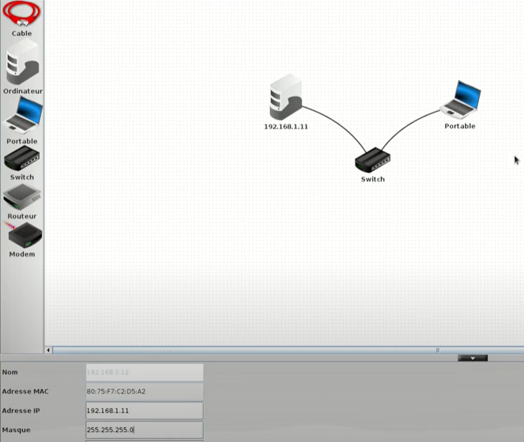
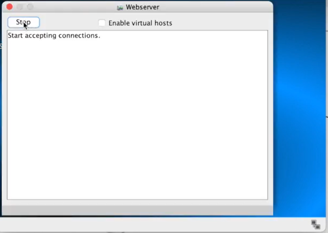

# Internet et réseaux

## Point historique

L'histoire d'Internet remonte aux années 1960 avec le projet ARPANET. Initié par le département américain de la Défense, ARPANET avait pour objectif de créer un réseau de communication résilient, capable de survivre à une attaque nucléaire. Il s'agissait d'une étape fondamentale dans le développement d'Internet tel que nous le connaissons aujourd'hui.

Au fil du temps, Internet s'est étendu et est devenu un réseau mondial interconnecté. Les années 1990 ont marqué une étape décisive avec l'avènement de l'Internet grand public, permettant à un nombre croissant de personnes d'accéder à des services en ligne, à des informations et de communiquer par le biais de courriers électroniques.

## Fonctionnement

Mais comment fonctionne Internet ?

Internet est un vaste réseau composé de nombreux ordinateurs, serveurs et autres dispositifs connectés. Son fonctionnement repose sur des protocoles et des normes qui facilitent l'échange d'informations et la transmission de données.

Le protocole TCP/IP (Transmission Control Protocol/Internet Protocol) est le fondement d'Internet. Il définit les règles pour la transmission des données entre les ordinateurs connectés au réseau. Le protocole TCP garantit la livraison fiable des données, tandis que le protocole IP s'occupe du routage des paquets de données à travers les différents réseaux.

Lorsqu'un utilisateur se connecte à Internet, son appareil se voit attribuer une adresse IP unique, qui lui permet de communiquer avec d'autres appareils sur le réseau. Les adresses IP sont utilisées pour acheminer les données entre les différents appareils connectés à Internet.

## Activité - filius

### Objectif

Le but de cette activité est de vous faire découvrir le fonctionnement d'Internet et de vous familiariser avec les protocoles TCP/IP.
Pour cela on va utiliser un simulateur de réseau nommé filius.

### Installation

Si le logiciel n'est pas déjà installé sur votre ordinateur, vous pouvez le télécharger à l'adresse suivante : [https://www.lernsoftware-filius.de/Herunterladen](https://www.lernsoftware-filius.de/Herunterladen)

Ensuite, il suffit de lancer le fichier téléchargé pour installer le logiciel.

### Prise en main

Lorsque vous lancez le logiciel, vous arrivez sur une fenêtre qui ressemble à ceci :


Sur la gauche se trouve la liste des appareils disponibles. Vous pouvez les faire glisser sur la zone de travail pour les ajouter au réseau.

Sur la droite se trouve la liste des appareils présents sur le réseau. Vous pouvez les faire glisser sur la zone de travail pour les supprimer du réseau.

Au centre se trouve la zone de travail. C'est ici que vous allez construire votre réseau.

### Etape 1 : Création d'un réseau local

1. Pour commencer, faites glisser deux ordinateur sur la zone de travail. Vous pouvez le placer où vous voulez.


2. Faites de même avec un switch.


### Etape 2 : Connexion des appareils

Pour que les appareils puissent communiquer entre eux, il faut les connecter entre eux. Pour cela, il faut utiliser des câbles réseau.

3. Utilisez le bouton "Câble réseau" pour créer un câble réseau. Cliquez sur le switch, puis sur l'ordinateur.


4. Faites de même pour connecter le deuxième ordinateur au switch.


### Etape 3 : Configuration des appareils

Maintenant que les appareils sont connectés, il faut les configurer pour qu'ils puissent communiquer entre eux.

5. Cliquez sur le premier ordinateur pour l'ouvrir. Cliquez sur l'onglet "Configuration" et remplissez les champs comme sur l'image ci-dessous. N'oubliez pas de cliquer sur "Appliquer" pour valider les changements.

> Ici, on défini que l'adresse IP de l'ordinateur est 192.0.1.11 c'est grâce à cette adresse que les autres appareils pourront communiquer avec lui.




6. Faites de même pour le deuxième ordinateur.


7. Si vous avez bien suivi les étapes précédentes, on va pouvoir tester la connexion entre les deux ordinateurs.

### Etape 4 : Test de la connexion

8. Passez en mode simulation en cliquant sur le bouton avec le triangle vert.


9. Cliquez sur le bouton sur "Installation de logiciel" pour installer un terminal de commande sur vos ordinateurs.


10. Cliquez sur l'onglet "Console" et tapez la commande suivante :

```bash
ping 192.0.1.12
```


> La commande ping permet de tester la connexion avec un autre appareil. Ici, on teste la connexion avec l'adresse IP. Ici on essaye d'enoyer un message au deuxième ordinateur.

Si on a bien suivi les étapes précédentes, on devrait voir apparaître ce message qui nous indique que la connexion est fonctionnelle.


### Etape 5 : Ajout d'un routeur et connexion à Internet

Maintenant que nous avons un réseau local fonctionnel, nous allons ajouter un routeur pour pouvoir nous connecter à Internet.

11. Faites glisser un routeur sur la zone de travail. On veut qu'il ai **2** interfaces réseaux.

12. On va maintenant connecter le routeur au switch. Pour cela, on va utiliser un câble croisé. Utilisez le bouton "Câble croisé" pour créer un câble croisé. Cliquez sur le switch, puis sur le routeur.


13. Cliquez sur le routeur pour l'ouvrir. Cliquez sur l'onglet "Configuration" et remplissez les champs comme sur l'image ci-dessous. N'oubliez pas de cliquer sur "Appliquer" pour valider les changements.


Il faut maintenant indiquer à l'ordinateur qu'il doit utiliser le routeur pour se connecter à Internet. Pour ca on doit lui préciser sa "porte de sortie" (gateway), on va donc y mettre d'adresse défini par se coté du routeur.


Ce routeur permet à son réseau local de se connecter à Internet. Maintenant pour tester la connexion, on va ajouter un server web qui hébergera un site web.

14. Faites glisser sur la zone de travail un nouvel ordinateur sur la zone de travail qui nous servira de serveur web. Puis, connectez le au routeur avec un câble.


13. On va maintenant configurer notre serveur. Pour cela double cliquez dessus pour l'ouvrir. Cliquez sur l'onglet "Configuration" et remplissez les champs comme sur l'image ci-dessous. N'oubliez pas de cliquer sur "Appliquer" pour valider les changements.


14. Sur le routeur on va définir la deuxième interface réseau comme on l'a fait pour le serveur : 10.78.0.250

15. On peut maintenant installer un serveur web sur notre serveur. Pour cela, on relance la simulation, on clique sur la nouvelle machine qui va nous servir de server, on va dans l'onglet "Installation de logiciel" et on installe le serveur web.


16. On peut lancer le serveur web en cliquant sur son icone et enfaisant "Démarrer".




17. On peut maintenant tester la connexion en allant sur un l'ordinateur d'IP "192.0.1.11" et en lui installant un navigateur web.


18. On peut ensuite aller sur le site web du serveur en tapant son adresse IP dans la barre d'adresse du navigateur.

```bash
10.78.4.4
```


On devrait arriver à ouvrir la page hébergée sur le serveur. Remarquez aussi qu'on vois les échanges de données entre les appareils.

Bravo, vous avez réussi à créer un réseau et à vous connecter à Internet ! Pour le reste d'internet, c'est pareil, il y a des routeurs qui permettent de connecter les réseaux entre eux c'est juste que l'ensemble est beaucoup plus vaste et complexe.
